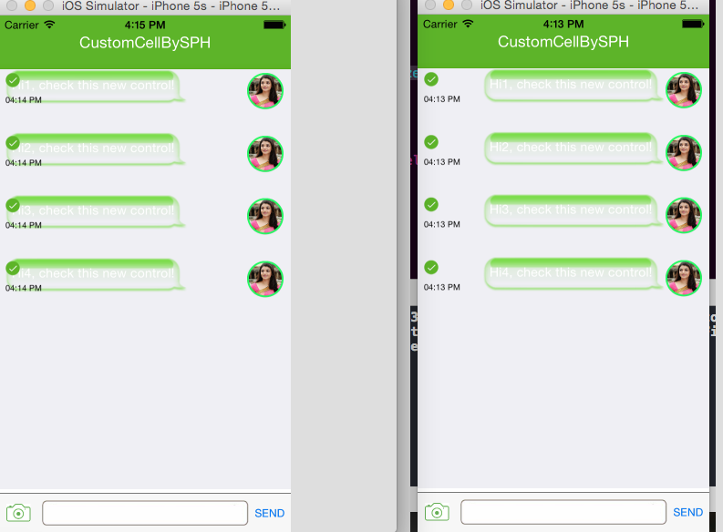
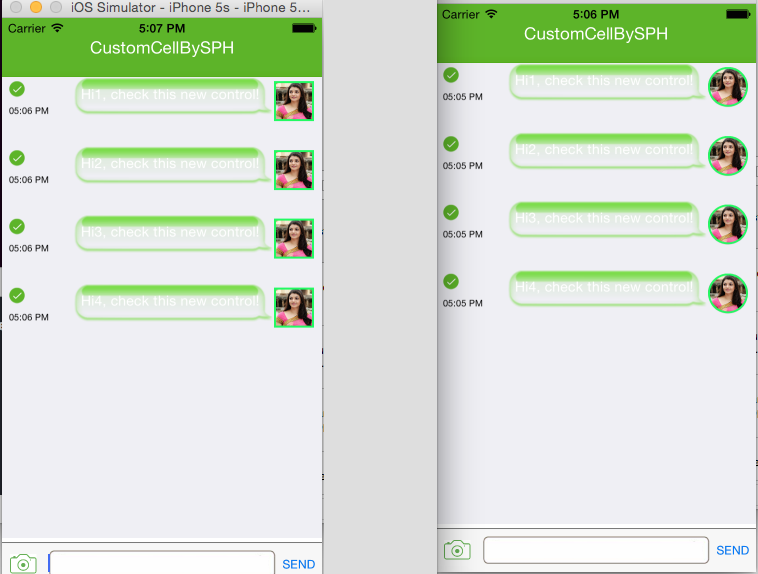
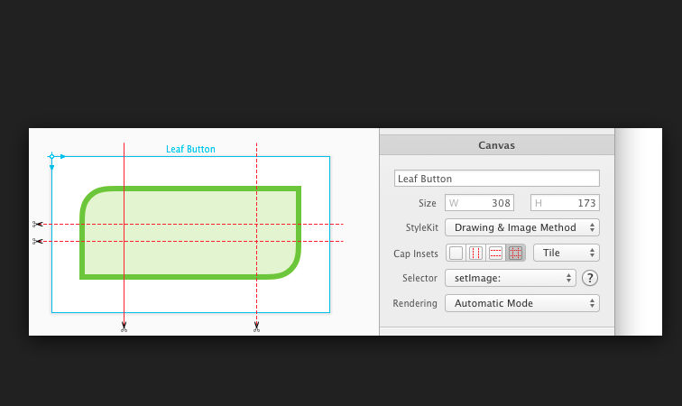

[toc]

网络下载的聊天程序界面 MODE 的源代码整理，日后用到时作为参考。[源文件地址](https://github.com/sibahota059/SPHChatCollectionView)，项目文件名称是 SPHChatCollectionView-master。自己照着这个项目另外写了一遍，变量名称也跟着改了一些。

#源码逻辑分析

1.在 AppDelegate 中初始化视图控制器并分配到根视图控制器。

2.视图控制器在 viewDidLoad 中调用 SetupDummyMessages 加载数据。并注册了 CELL 的 xib 文件。视图控制器使用 collectionView:layout:sizeForItemAtIndexPath: 调整文字内容的 CELL 尺寸。

3.在视图控制器的委托 collectionView:cellForItemAtIndexPath: 读取数据，实例化 CCBCollectionViewCell，调用 CCBCollectionViewCell 的 setFeedData 生成聊天界面。

4.在 setFeedData 中，根据数据类型判断生成图片气泡还是文字气泡。

5.生成文字气泡，使用 CCBTextBubbleView 类。生成图片气泡，使用 CCBImageBubbleView 类。


#AppDelegate

##application:didFinishLaunchingWithOptions:

从这个函数中分配当前视图控制器和根视图控制器，并使窗口可见，所以调试第一步从这里开始

```

- (BOOL)application:(UIApplication *)application didFinishLaunchingWithOptions:(NSDictionary *)launchOptions {
    // Override point for customization after application launch.
    self.window = [[UIWindow alloc] initWithFrame:[[UIScreen mainScreen] bounds]];
    //初始化 CCBViewCOntroller 类，在 viewDidLoad 中执行其它操作
    self.viewController = [[CCBViewController alloc] initWithNibName:@"CCBViewController" bundle:nil];
    self.window.rootViewController = self.viewController;
    [self.window makeKeyAndVisible];
    return YES;
}

```

#CCBViewController

这个程序只有一个视图控制器，绑定了从 UIViewController 继承的 CCBViewController 类，实现了 UICollectionViewDelegate 和 UICollectionViewDataSource 协议。界面从 xib 文件加载，在 xib 文件中，作为视图控制器的控件是 View，使用 CollectionView 作为存放对话行的内容，对话行使用 CCBCollectionViewCell 类来自定义外观，行在视图控制器的 collectionView:cellForItemAtIndexPath 加载并设置外观。

##viewDidLoad

```

- (void)viewDidLoad {
    
    
    [super viewDidLoad];
    
    //在这里注册 xib 中的 CELL，经过注册的 CELL 才可以使用。
    [self.sphChatTable registerNib:[UINib nibWithNibName:@"Cell" bundle:nil] forCellWithReuseIdentifier:CellIdentifier];
    //设置聊天的对话内容数据 这个函数中会调用 [self.sphChatTable reloadData]; 使 CollectionView 重新加载它的 ITEM 数据
    [self SetupDummyMessages];

	....
	....
	
}

```
##collectionView:cellForItemAtIndexPath:

最常用的函数，按顺序生成每一行 CELL。

```
- (UICollectionViewCell *)collectionView:(UICollectionView *)collectionView cellForItemAtIndexPath:(NSIndexPath *)indexPath
{
    
CCBCollectionViewCell *cell = [collectionView dequeueReusableCellWithReuseIdentifier:CellIdentifier forIndexPath:indexPath];

    //设置 cell 属性
    cell.layer.shouldRasterize = YES;
    cell.layer.rasterizationScale = [UIScreen mainScreen].scale;
    
/*

资料地址：http://jeffreysambells.com/2013/03/01/asynchronous-operations-in-ios-with-grand-central-dispatch
C 语言的 API，GCD。

异步执行一些耗时的方法，避免用户界面被锁定。
这些代码会分配到其它线程中执行，让你的 UI 主线程继续执行任务。
GCD 队列可以并发执行或者排队执行(当它们是一个队列，并且一个执行完成之后后面的接着执行)

完整笔记地址：未完成

*/
    dispatch_async(dispatch_get_main_queue(), ^
                   {
                       //        循环该表格行中所有子视图,将子视图从父视图中移除

                       for (UIView *v in [cell.contentView subviews])
                           [v removeFromSuperview];      
                                            
                       //判断该行当前是否处于可见状态
                       if ([self.sphChatTable.indexPathsForVisibleItems containsObject:indexPath])
                       {
                       //根据对话内容的不同，生成不同样式的 CELL 对话界面
                           [cell setFeedData:(CCB_PARAM_List*)[sphBubbledata objectAtIndex:indexPath.row]];
                       }
                   });
    
    
//    CCB_PARAM_List *obj =(CCB_PARAM_List *)[sphBubbledata objectAtIndex:indexPath.row];
//    cell.ttlabel.text=obj.chat_message;
    
    return cell;
}
```

##setFeedData:

这个函数内是主要的设置对话界面的样式，通过 sphBubbledata.chat_media_type 判断如何渲染对话界面

```

if ([feed_data.chat_media_type isEqualToString:kSTextByme]) 
{
	....
}
else if ([feed_data.chat_media_type isEqualToString:kSTextByOther])
{
	....
}
else if ([feed_data.chat_media_type isEqualToString:kSImagebyme])
{
	....
}
else
{
}
```

下面是其中一个条件的执行语句

```

if ([feed_data.chat_media_type isEqualToString:kSTextByme]) {
        
        //生成聊天文本气泡
        CCBTextBubbleView *textMessageBubble=[[CCBTextBubbleView alloc]
                                              initWithText:feed_data.chat_message
                                              withColor:GREEN_TEXT_BUBBLE_COLOR
                                              withHighlightColor:[UIColor whiteColor]
                                              withTailDirection:MessageBubbleViewButtonTailDirectionRight
                                              maxWidth:MAX_BUBBLE_WIDTH];
        
        /*
         
         
         -sizeToFit should not be called if you are using auto-layout. That's part of the 'old' system.
         
         调整聊天文本气泡内文字的位置，类重写了这个方法，自定义了一些修改。
         */
        [textMessageBubble sizeToFit];
        
        //设置聊天文本气泡的位置和宽度感度，图 1-2 对比了修改参数后的变化 从 265 改为 200
        textMessageBubble.frame = CGRectMake(265-textMessageBubble.frame.size.width, 0, textMessageBubble.frame.size.width, textMessageBubble.frame.size.height+20);
        [self.contentView addSubview:textMessageBubble];
        
        //设置时间文本
        UILabel *timeLabel = [[UILabel alloc] initWithFrame:CGRectMake(0, self.frame.size.height-30, 55, 20)];
        timeLabel.text = feed_data.chat_date_time;
        timeLabel.font = [UIFont systemFontOfSize:9];
        timeLabel.textColor = [UIColor blackColor];
        [self.contentView addSubview:timeLabel];
        
        
        //设置发送状态，发送中时以一个动画表示，完成后分为成功和失败两种情况
        if([feed_data.chat_send_status isEqualToString:kSending])
        {
            //初始化一个动态指示器
            UIActivityIndicatorView *myIndicator = [[UIActivityIndicatorView alloc] initWithActivityIndicatorStyle:UIActivityIndicatorViewStyleGray];
            [myIndicator setFrame:CGRectMake(0, self.frame.size.height-50, 20, 20)];
            [myIndicator startAnimating];
            [self.contentView addSubview:myIndicator];
            
        }else{
            //设置发送标识
            UIImageView *imgView = [[UIImageView alloc] initWithFrame:CGRectMake(0, self.frame.size.height-50, 16, 16)];
            if([feed_data.chat_send_status isEqualToString:kSent]){
                [imgView setImage:[UIImage imageNamed:@"sentSucess"]];
            }else{
                [imgView setImage:[UIImage imageNamed:@"sentFailed"]];
            }
            
            [self.contentView addSubview:imgView];
        }
        
        
        //设置头像
        UIImageView *AvatarView = [[UIImageView alloc] initWithFrame:CGRectMake(265, self.frame.size.height-50, 40, 40)];
       
        [AvatarView setImage:[UIImage imageNamed:@"person"]];
        
//        修改图像的形状 图 1-3 对比下面两行代码屏蔽后的效果
//        cornerRadius 为 20 刚好是圆形，设置 masksToBounds 为 YES 之后 cornetRadius 的区域会覆盖图像，类事 PS 中的蒙板。
        AvatarView.layer.cornerRadius  = 20.0;
        AvatarView.layer.masksToBounds = YES;
        
        AvatarView.layer.borderColor = [UIColor colorWithRed:0.1341 green:0.979 blue:0.3848 alpha:1.0].CGColor;//边框颜色
        AvatarView.layer.borderWidth = 2.0;//边框宽度
        
        [self.contentView addSubview:AvatarView];
        
    }


```

**图 1-2** textMessageBubble.frame 的参数调整对比的效果



**图 1-3** 图片圆角的效果



##collectionView:layout:sizeForItemAtIndexPath:

在这个委托中实现 CELL 尺寸的调整，使它适应文本的高度

```

CCB_PARAM_List *feed_data = [[CCB_PARAM_List alloc] init];
    
    feed_data =[sphBubbledata objectAtIndex:indexPath.row];
    
    if ([feed_data.chat_media_type isEqualToString:kSTextByme] || [feed_data.chat_media_type isEqualToString:kSTextByOther]) {
        
        //计算文本的高度
        
        NSStringDrawingContext *ctx = [NSStringDrawingContext new];
        
        NSAttributedString *aString = [[NSAttributedString alloc] initWithString:feed_data.chat_message];
        
        UITextView *calculationView =[[UITextView alloc] init];
        
        [calculationView setAttributedText:aString];
        
        
        CGRect textRect = [calculationView.text boundingRectWithSize:CGSizeMake(TWO_THIRDS_OF_PORTRAIT_WIDTH, 10000000) options:NSStringDrawingUsesLineFragmentOrigin attributes:@{NSFontAttributeName:calculationView.font} context:ctx];
        
        return CGSizeMake(306, textRect.size.height+40);
        
    }
    
    return CGSizeMake(306, 90);
    
```


#CCBCollectionViewCell

聊天对话 CELL 的类，CELL 的资源文件也是从 xib 文件中加载。在 ViewController 的 viewDidLoad 中加载并注册

```

[self.sphChatTable registerNib:[UINib nibWithNibName:@"Cell" bundle:nil] forCellWithReuseIdentifier:CellIdentifier];

```
## CCBTextBubbleView

生成聊天文字气泡的类

###sizeToFit

```

-(void) sizeToFit
{
    [super sizeToFit];
    //设置聊天文本气泡的 frame
    self.frame =UIEdgeInsetsInsetRect(self.frame, UIedgeInsetsNegate(self.contentInsets));
    
    //设置气泡的背景
    self.bubbleImageView.frame = self.bounds;
    
    //设置文本内容 label 的 frame。
    CGRect frm=self.bubbleImageView.frame;
    frm.size.width-=10;
    frm.origin.x+=x;
    self.myMessageTextView.frame = frm;
}

```

### initWithText:withColor:withHighlightColor:withTailDirection:maxWidth:

生成聊天文字气泡的函数

```

-(id) initWithText:(NSString *)text withColor:(UIColor *)color withHighlightColor:(UIColor *)highlightColor withTailDirection:(MessageBubbleViewButtonTailDirection)tailDirection maxWidth:(CGFloat)maxWidth
{
    if (self = [super init]) {
        
        self.textMessage = text;
        
        UIEdgeInsets imageInsets = IMAGE_INSETS;
        UIImageOrientation bubbleOrientation;
        
        /*
         资料来源：http://www.zhihu.com/question/26605346
         
         例如声明了一个叫param的property
         @property （nonatomic， copy）NSString *param;
         通过_param进行存取的话是不会调用该变量的setter或者getter方法的，声明的copy也就不会起作用，而通过self.param调用的话是会调用setter或者getter方法的，这样copy也就会起作用。
         
         */
        _maxWidth = maxWidth;
        
        //设置聊天气泡的方向
        x=2;
        if (tailDirection == MessageBubbleViewButtonTailDirectionLeft) {
            x=7;
            self.contentInsets = LEFT_CONTENT_INSETS;
            bubbleOrientation = UIImageOrientationUpMirrored;
        }
        else
        {
            self.contentInsets = RIGHT_CONTENT_INSETS;
            bubbleOrientation = UIImageOrientationUp;
        }
        
        //加载聊天气泡的图片到 UIImage 中
        UIImage *coloredImage = [[UIImage imageNamed:@"ImageBubble@2x~iphone"] maskWitColor:color];
        
        //imageWithCGImage:scale:orientation 创建并返回一个特定伸缩系数和方向的图片，scale 指定为 1.0 时设置为图像的原本像素尺寸。
        //resizableImageWithCapInsets:resizingMode 创建并返回一个图像，该图像是原图像的 cap insets，并设置了 resizingMode 属性 图 1-4 说明了 cap insets 的范围
        UIImage *backgroundImageNormal = [[UIImage imageWithCGImage:coloredImage.CGImage scale:1.0 orientation:bubbleOrientation] resizableImageWithCapInsets:imageInsets resizingMode:UIImageResizingModeStretch];
        
        //创建一个 capInset 大小的图像
        _bubbleImageView = [[UIImageView alloc] initWithImage:backgroundImageNormal];
        _bubbleImageView.frame = self.frame;//指定 frame 与聊天气泡的 frame。frame 决定了视图在它的父视图中的位置和尺寸
        [self addSubview:_bubbleImageView];
        
        //设置聊天气泡内的文字
        _myMessageTextView=[[UITextView alloc] initWithFrame:self.frame];
        _myMessageTextView.text=text;
        _myMessageTextView.backgroundColor=[UIColor clearColor];
        _myMessageTextView.textColor = highlightColor;
        _myMessageTextView.editable = NO;
        _myMessageTextView.scrollEnabled=NO;
        _myMessageTextView.dataDetectorTypes = UIDataDetectorTypeAll;
        _myMessageTextView.font = [UIFont systemFontOfSize:kBubbleTextSize];
        _myMessageTextView.textAlignment = NSTextAlignmentJustified;
        [self addSubview:_myMessageTextView];
        
        
        self.backgroundColor = UIColor.clearColor;
        
        [self autoresizesSubviews];
        
    }
    
    return self;
    
}

```

**图 1-4**  cap insets 的范围



## CCBImageBubbleView

聊天图像气泡的类，从 UIView 继承。

### initWithImage:withTailDirection:atSize:

这个方法加载图片，并进行类似 PS 的蒙板处理。

具体步骤是加载蒙板图片，然后调整适当大小，然后加载实际图片，然后在 `UIImageView *maskedImageView = [[UIImageView alloc] initWithImage:[image maskWithImage:maskImageDrawnToSize]]；` 把两张图片进行合并。


```

-(id) initWithImage:(UIImage *)image withTailDirection:(MessageBubbleVIewTailDirection)tailDirection atSize:(CGSize)size
{
    if(self = [super init])
    {
        self.imageSize = size;
        UIEdgeInsets imageInsets = IMAGE_INSETS;
        UIImageOrientation bubbleOrientation;
        
        if(tailDirection == MessageBubbleViewTailDirectionLeft)
        {
            _contentInsets = LEFT_CONTENT_INSETS;
            bubbleOrientation = UIImageOrientationUpMirrored;
        }
        else
        {
            _contentInsets = RIGHT_CONTENT_INSETS;
            bubbleOrientation = UIImageOrientationUp;
        }
        
        UIImage *coloredImage =[[UIImage imageNamed:@"ImageBubbleMask~iphone"] maskWitColor:[UIColor colorWithRed:0.439216 green:0.854902 blue:0.223529 alpha:1]];
        
        _backgroundImageNormal = [[UIImage imageWithCGImage:coloredImage.CGImage scale:1.0 orientation:bubbleOrientation] resizableImageWithCapInsets:imageInsets resizingMode:UIImageResizingModeStretch];
        
        _backgroundImageView = [[UIImageView alloc] initWithImage:_backgroundImageNormal];
        _backgroundImageView.frame = self.bounds;
        _backgroundImageView.autoresizingMask = UIViewAutoresizingFlexibleHeight | UIViewAutoresizingFlexibleWidth;
        
        const UIImage *maskImageDrawnToSize = [_backgroundImageNormal renderAtSize:CGSizeMake(90, 90)];
        
        //两个图片合并
        UIImageView *maskedImageView = [[UIImageView alloc] initWithImage:[image maskWithImage:maskImageDrawnToSize]];
        
        
        [self addSubview:maskedImageView];
        
    }
    return self;
}

```

#其它知识点

## @class

告诉编译器代码所依赖的文件的位置，但是使用 @class 时，你并不能调用 @class 中的实例方法，因为它的元数据没有提供给编译器。

例如，你有两个类：

```
@interface A:NSObject
- (B*)calculateMyBNess;
@end

@interface B:NSObject
- (A*)calculateMyANess;
@end

```
这时编译是失败的，因为它们互相依赖，这时加上 @class 就能正常编译。

```
@class B;
@interface A:NSObject
- (B*)calculateMyBNess;
@end

@interface B:NSObject
- (A*)calculateMyANess;
@end 	

```

来源：[http://stackoverflow.com](http://stackoverflow.com/questions/10019961/objective-c-class-directive-before-interface)

##category

A category allows you to add methods to an existing class—even to one for which you do not have the source.

Categories are a powerful feature that allows you to extend the functionality of existing classes without subclassing.

该源代码使用 category 拓展了 UIImage。文件名称为 UIImage+Utils。所以可以在 CCBImageBubbleView.m 中 UIImage 的实例调用自定义的方法：

`const UIImage *maskImageDrawnToSize = [_backgroundImageNormal renderAtSize:CGSizeMake(90, 90)];`

## extension (.m 文件中的 @interface {} )


可以在 extension 中重新定义 .h 文件中声明的属性或方法，达成私有属性或私有函数的目的。extension 必须定义在与它相关联的 .m 文件中

例如，属性在 .h 文件中定义是只读的，但在 .m 文件中用上了 extension，更改它的属性为可读写，那么 .m 中就可以调用 setObject。但是使用这个类的用户因为没有引用 .m 文件，所以属性仍然是只读的。

所有在 extension 声明的 property 或者 methods 必须出现在类的 main implementaion block 中。

例子：

[资料来源：](http://code.tutsplus.com/tutorials/objective-c-succinctly-categories-and-extensions--mobile-22016)

```

// Ship.h
#import <Foundation/Foundation.h>
#import "Person.h"
 
@interface Ship : NSObject
 
@property (strong, readonly) Person *captain;
 
- (id)initWithCaptain:(Person *)captain;
 
@end

```


```

// Ship.m
#import "Ship.h"
 
 
// The class extension.
@interface Ship()
 
@property (strong, readwrite) Person *captain;
 
@end
  
// The standard implementation.
@implementation Ship
 
@synthesize captain = _captain;
 
- (id)initWithCaptain:(Person *)captain {
    self = [super init];
    if (self) {
        // This WILL work because of the extension.
        [self setCaptain:captain];
    }
    return self;
}
 
@end

```

其它人的解释：

> 实现一个不可变(immutable)的数据结构通常有一个好处是外部代码不能用setter修改对象的状态。然而,可能又希望它在内部又是一个可写的属性。Class extensions可以做到这一点:在公共接口(类的声明中)中,开发者可以声明一个属性是只读的,随后在类扩展中声明为可写。这样，对外部代码而言,该属性将是只读的,而内部代码却可以使用它setter方法。

## dispatch_async

[资料地址](http://jeffreysambells.com/2013/03/01/asynchronous-operations-in-ios-with-grand-central-dispatch)

是 C 语言的 API，GCD。

异步执行一些耗时的方法，避免用户界面被锁定。
这些代码会分配到其它线程中执行，让你的 UI 主线程继续执行任务。
GCD 队列可以并发执行或者排队执行(当它们是一个队列，并且一个执行完成之后后面的接着执行)

## UICollectionViewLayout

挺大的内容：https://developer.apple.com/library/prerelease/ios/documentation/WindowsViews/Conceptual/CollectionViewPGforIOS/CreatingCustomLayouts/CreatingCustomLayouts.html。

详细链接(未完成)

## options:@{}

问题来源：

```

CGRect textRect=[calculationView.text 
boundingRectWithSize:CGSizeMake(self.maxWidth-self.contentInsets.left-self.contentInsets.right, 10000000)
options:NSStringDrawingUsesLineFragmentOrigin 
attributes:@{NSFontAttributeName:calculationView.font} //这里
context:ctx];

```

查看文档后，`boundingRectWithSize:options:attributes:context:` 中 `attributes:` 所需要的类型是 `NSDictionary`，所以 `@{}` 是生成一个字典。

`calculationView.font` ：This property applies to the entire text string. The default font is a 17-point Helvetica plain font.

`NSFontAttributeName`，是通过封装的 `NSString`：
```
UIKIT_EXTERN NSString *const NSFontAttributeName NS_AVAILABLE_IOS(6_0);// UIFont, default Helvetica(Neue) 12
```

`NSFontAttributeName:calculationView.font` 会返回一系列字符串，然后通过 @{} 生成字典，传入 attributes。


## UIEdgeInsetsMake

Creates an edge inset for a button or view.

上面的图 1-4 说明了什么事 edge inset。

在生成图片时作为参数传递进去：

```
#define IMAGE_INSETS UIEdgeInsetsMake(13,13,13,21)

UIEdgeInsets imageInsets = IMAGE_INSETS;

UIImage *backgroundImageNormal = 
	[
	[UIImage  imageWithCGImage:coloredImage.CGImage 
				scale:1.0 
				orientation:bubbleOrientation] 
	resizableImageWithCapInsets:imageInsets //作为参数传递
	resizingMode:UIImageResizingModeStretch];

```
