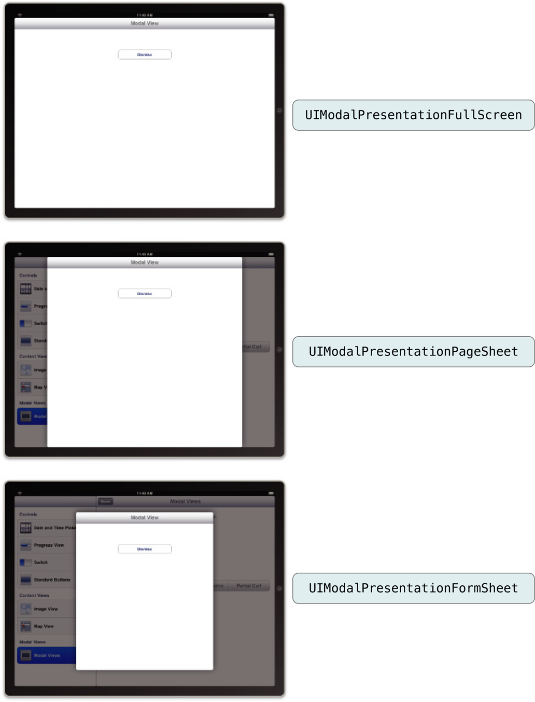

# 通过其它视图控制器呈现视图控制器

这种呈现视图控制器的能力可以让你中断当前的工作流程并显示新的视图集合。大部分情况下，应用程序呈现视图控制器临时中断工作流程是为了向用户获取重要数据。但是，你也可以使用被呈现的视图控制器使应用程序在特定的时间显示备用界面。

## 视图控制器如何呈现其它视图控制器

被呈现的视图控制器不是 [UIViewController]() 的特殊子类 (如 `UITabBarController` 或 `UINavigationController`)。任意视图控制器都可以通过你的应用程序呈现。例如标签栏和导航控制器，当你想传达之前的视图层次结构和新呈现的视图层次结构之间的关系相关的特定含义时你可以呈现视图控制器。

当你呈现模态视图控制器时，系统会在呈现中的视图控制器和将要被呈现的视图控制器之间创建关系。进一步解释，呈现中的视图控制器会更新它的 [presentedViewController]() 属性指向被呈现的视图控制器。同样，被呈现的视图控制器会更新它的 [presentingViewController]() 属性往回指向呈现它的视图控制器。图 10-1 展示在日历应用程序中管理主屏幕的视图控制器和被用作创建新事件的被呈现视图控制器之间的关系。

**图 10-1** 日历应用程序中被呈现的视图。


任何视图控制器对象都可以在同一时间内呈现一个单独的视图控制器，即使视图控制器它们自己就是通过其它视图控制器呈现的也是可以的。换句话说，你可以使被呈现的视图控制器以队列的方式一起出现，根据需要在其它视图控制器的顶部呈现新的视图控制器。图 10-2 展示队列的过程和触发的动作的可视化表现。在这个例子中，当用户点击相机视图中的图标时，应用程序会呈现显示用户照片的视图控制器。点击图像库的工具栏中的动作按钮会提示用户选择相应的动作然后对该动作呈现另一个视图控制器 (人员选取器)。选择联系人后 (或取消人员选择器) 会退出该界面并使用户回到图像库中。点击完成按钮会退出图像库并使用户回到相机界面。

**图 10-2** 创建模态视图控制器的队列


在被呈现的视图控制器的队列中的每个视图控制器都有指向它在队列中周围的其它对象。换句话说，呈现其它视图控制器的被呈现视图控制器的 [presentingViewController]() 和 [presentedViewController]() 属性都拥有有效对象。你可以根据需要使用这些关系追踪通过队列的视图控制器。例如，如果用户取消当前的操作，你可以通过解散第一个被呈现的视图控制器来移除队列中的所有对象。解散视图控制器所解散的不仅仅是视图控制器，也会解散所有由它呈现的视图控制器。

在图 10-2 中，值得提到的一点是被呈现的视图控制器都是导航控制器。你可以呈现 [UINavigationController]() 对象与你将呈现的内容视图控制器使用同一种方式。

当呈现导航控制器时，你需要呈现的总是 `UINavigationController` 对象本身，而不是呈现位于导航堆栈的任意视图控制器。但是，个别位于导航堆栈的视图控制器可能会呈现其它视图控制器，包括导航控制器。图 10-3 展示在前面涉及的例子中更详细的对象。如你所见，人员选择器不是被图像库的导航控制器呈现而是通过导航堆栈 (图像库的导航堆栈) 的其中一个内容视图控制器呈现。

**图 10-3** 模态呈现导航视图控制器


## 模态视图的呈现风格

对于 iPad 应用程序，你可以使用几种不同的风格呈现内容。在 iPhone 应用程序中，被呈现的视图总是会覆盖窗口的可见部分，但当它运行在 iPad 上时，视图控制器会使用它的 [modalPresentationStyle]() 属性中的值决定它们被呈现时的外观。这个属性的不同选项让你呈现的视图控制器可以完全填充屏幕或只填充一部分屏幕。

图 10-4 展示了可用的核心呈现风格。([UIModalPresentationCurrentContext]() 风格使视图控制器遵循它的父辈的风格。)在每个呈现风格中，变暗的区域显示的是底下的内容但不允许点击内容。因此，不像 popover，你所呈现的视图必须拥有一个控件使用户可以退出该视图。

**图 10-4** iPad 的呈现风格



更多使用不同的呈现风格的指导，见 [Modal View]()。

## 呈现视图控制器并选择过渡风格

当使用故事板的 segue 呈现视图控制器时，它会自动实例化并呈现。呈现中的视图控制器可以在目标视图控制器被呈现之前对它进行配置。更多信息，见 [Configuring the Destination Controller When a Segue is Triggered]()。

如果你需要以编程方式呈现视图控制器，你不需做以下的事情：

1.创建你想要呈现的视图控制器。
2.设置视图控制器的 [modalTransitionStyle]() 属性为期望值。
3.对视图控制器分配委托对象。通常，委托是呈现中的视图控制器。这个委托由被呈现的视图控制器使用当它准备消失时通知呈现中的视图控制器。它也可以传达其它信息返回给委托。
4.调用当前视图控制器的 [presentViewController:animated:completion:]() 方法，将你想要呈现的视图控制器传递进去。

`presentViewController:animated:completion:` 方法为指定的视图控制器对象呈现视图并在当前的视图控制器和新的视图控制器之间配置呈现中－被呈现 (presenting-presented) 关系。除了恢复之前的状态，我们一般都想动画新视图控制器的外观。你应该使用的过渡风格取决于你计划如何使用被呈现的视图控制器。表 10-1 列出你可以分配到被呈现的视图控制器的 [modalTransitionStyle]() 属性的过渡风格并且描述了如何使用每一个。

过渡风格  | 用途
------------- | -------------
[UIModalTransitionStyleCoverVertical]()  | 当你想中断当前的工作流程向用户收集信息时使用这个风格。你也可以使用它呈现用户可以或不可以修改的内容。对于这个过渡风格，内容视图控制器应该提供明显的按钮使用户可以退出这个视图控制器。通常这些按钮是取消按钮或完成按钮。如果你没有明确的设置过渡风格，那么这个是默认风格。
[UIModalTransitionStyleFlipHorizontal]()  | 使用这个风格临时更改应用程序的工作模式。这个风格的大部分用途是显示可能频繁更改的设置，例如股票和天气应用程序。这些设置可以应用到整个应用程序或者指定到当前屏幕。对于这个过渡风格，通常会提供一些有序的按钮使用户回到应用程序的正常运行模式。
[UIModalTransitionStyleCrossDissolve]() | 当设备方向更改时使用这个风格呈现备用的界面。在这种情况下，你的应用程序在响应方向更改通知时复杂呈现和解散备用界面。多媒体应用程序也可以使用这个风格淡入屏幕显示多媒体内容。如何实现响应界面方向更改时使用备用界面的例子，见 [Creating an Alternate Landscape Interface](https://developer.apple.com/library/ios/featuredarticles/ViewControllerPGforiPhoneOS/RespondingtoDeviceOrientationChanges/RespondingtoDeviceOrientationChanges.html#//apple_ref/doc/uid/TP40007457-CH7-SW14)。

清单 10-1 展示如何以编程方式呈现视图控制器。当用户添加食谱时，应用程序通过呈现一个导航视图控制器提示用户输入关于食谱的基本信息。被选择的是导航视图控制器所以会在标准的位置摆放取消和完成按钮。使用导航控制器也使未来需要拓展新食谱界面时变得轻松。所有你需要做的只是把新的视图控制器推送到导航堆栈中。

清单 10-1 编程方式呈现视图控制器。

```

- (void)add:(id)sender {
   // Create the root view controller for the navigation controller
   // The new view controller configures a Cancel and Done button for the
   // navigation bar.
   RecipeAddViewController *addController = [[RecipeAddViewController alloc]
                       init];
 
   // Configure the RecipeAddViewController. In this case, it reports any
   // changes to a custom delegate object.
   addController.delegate = self;
 
   // Create the navigation controller and present it.
   UINavigationController *navigationController = [[UINavigationController alloc]
                             initWithRootViewController:addController];
   [self presentViewController:navigationController animated:YES completion: nil];
}

```

当用户在新食谱输入界面点击完成或取消其中一个按钮时，应用程序会退出视图控制器并使用户回到主窗口。见 [Dismissing a Presented View Controller]()。

## 呈现上下文提供被呈现的视图控制器所覆盖的区域

被用作呈现区域的屏幕区域由呈现上下文决定。默认情况下，呈现上下文由根视图控制器提供，它的框架会被用作定义呈现上下文的框架。但是，呈现中的视图控制器或者在视图层次结构中的其它父辈，都可以选者由它们提供呈现上下文。在这种情况下，当呈现上下文是由其它视图控制器提供时，它们的框架会被用作决定被呈现的视图的框架。这种灵活的方式可以让限制模态呈现成屏幕的一小部分，让其它内容可以显示。

当视图控制器呈现后，iOS 会搜索它的呈现上下文。首先由读取呈现中的视图控制器的 [definePresentationContext]() 属性开始。如果这个属性的值是 YES，那么由呈现中的视图控制器定义呈现上下文。否则，它会继续往视图控制器的层次结构上方搜索直到有视图控制器返回 YES 或者到达窗口的根视图控制器。

当视图控制器定义呈现上下文时，它也可以选择定义呈现风格。通常，被呈现的视图控制器使用它的 [modalTransitionStyle]() 属性决定如何呈现。设置了 definesPresentationContext 为 YES 的视图控制器也可以设置它的 [providesPresentationContextTransitionStyle]() 为 YES。如果 [providesPresentationContextTransitionStyle]() 设置成了 YES，iOS 会使用呈现上下文的 modalPresentationStyle 决定如何呈现新的视图控制器。


## 解散被呈现的视图控制器

当需要解散被呈现的视图控制器时，最好的方式是让呈现中的视图控制器解散它。换句话说，最要有可能，都应该由同一个呈现中的视图控制器负责解散它。尽管有几种方法通知呈现中的视图控制器需要它解散被呈现的视图控制器，但是最好的技术是使用委托。更多信息，键 [Using Delegation to Communicate with Other Controllers]()。

## 呈现标准系统视图控制器

有几个标准的系统视图控制器设计来让你的应用程序呈现。呈现这些视图控制器的基础规则与呈现你的自定义内容视图控制器规则相同。但是，因为你的应用程序不可以访问系统视图控制器管理的视图层次结构，你不能简单的实现视图中控件的动作。要与系统视图控制器交互通常通过委托对象进行。

每个系统视图控制器都定义了响应的协议，你可以在你的委托对象中实现这些方法。每个委托通常会实现方法接收项被选中或取消的操作。你的委托对象应该始终准备处理这两种情况。最重要的一件事是委托必须要实现解散被呈现的视图控制器通过调用正在呈现的视图控制器的 [dismissModalViewControllerAnimated:]() 方法 (换句话说，被呈现的视图控制器的父辈)。

表 10-2 列出几个 iOS 中的标准系统视图控制器，更多关于这些类的信息，包括它们提供的功能，见相应的类引用文档。

**表 10-2** 标准系统视图控制器

框架  | 视图控制器
------------- | -------------
Address Book UI | ABNewPersonViewController<br />ABPeoplePickerNavigationController<br />ABPersonViewController<br />ABUnknownPersonViewController
Event Kit UI | EKEventEditViewController<br />EKEventViewController<br />
Game Kit | GKAchievementViewController<br />GKLeaderboardViewController<br />GKMatchmakerViewController<br />GKPeerPickerController<br />GKTurnBasedMatchmakerViewController<br />
Message UI | MFMailComposeViewController<br />MFMessageComposeViewController
Media Player | MPMediaPickerController<br />MPMoviePlayerViewController
UIKit | UIImagePickerController<br />UIVideoEditorController


**说明：** 尽管 [MPMoviePlayerController]() 类是在 Media Player 框架中可以在技术上被认为是模态视图控制器，但在语法的使用上略有不同。对于你的呈现中视图控制器，你需要初始化它并告诉它将要播放的多媒体文件。然后由视图控制器处理其它方面的呈现和解散它的视图。(但是，[MPMoviePlayerController]() 类用作 `MPMoviePlayerController` 的替代作为标准视图控制器播放影片。)