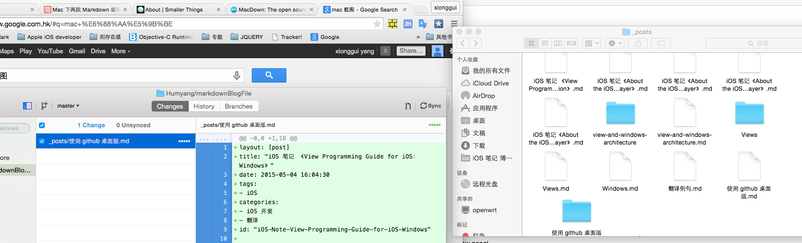
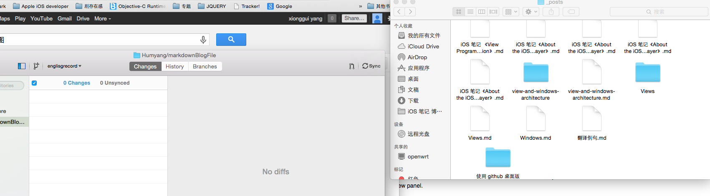

layout: [post]
title: "iOS 笔记 《View Programming Guide for iOS：Windows》"
date: 2015-05-04 16:04:30
tags: 
- iOS
categories: 
- iOS 开发
- 翻译
id: "iOS-Note-View-Programming-Guide-for-iOS-Windows"

---
使用 github 桌面版本的记录

#分支

设置不同分支时，磁盘中文件也会变化。例如你在主新创建或修改文件，切换到分支 A 后是没有这些文件的。同样修改分支 A 的文件也不会影响到主分支的文件。如图 1-1 和图 1-2，切换分支后的文件发生变化。

**图 1-1 和 图1-2** 切换分支后文件的变化

Github 主要以主分支为主，当分支 A 的操作提交合并请求到 Github 后，再由项目的发起人同意该分支合并到主分支。合并完成后再主分支同步一下就可以完成修改的同步。

下面为这篇博文创建一个分支：useGithub，然后测试修改一些内容，提交合并到主分支的请求，然后查看主分支的变化。

1. 创建分支 useGithub。如图 1-3。
2. 切换到该分支，因为该分支是依据主分支创建的，所以与主分支的内容一样。就连主分支没提交的内容也是一样的，这是因为实在相同的 PC 中。如图 1-4。
3. 切换回主分支，发现没提交的内容都消失了，Github 果然神奇。如图 1-5。
4. 